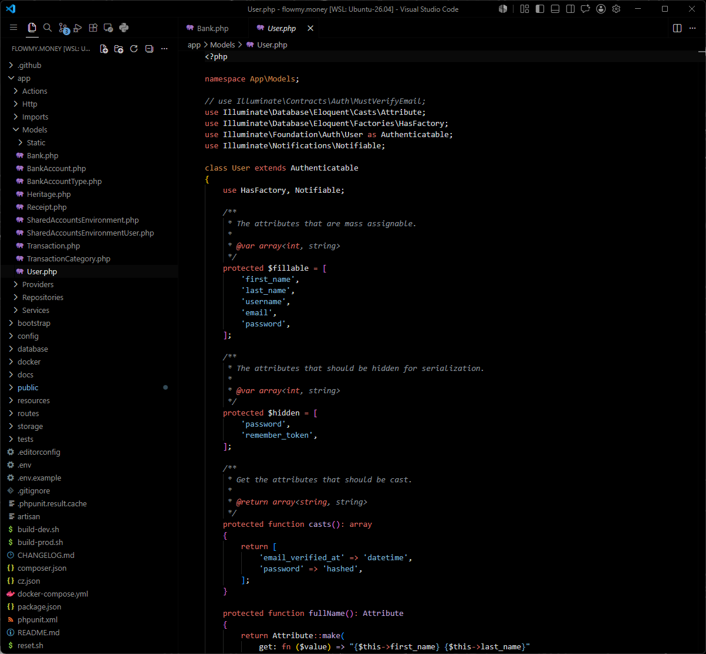

# Absolute Black

Minimalist theme with an absolute black background.



Quick local installation:

1. Open the project folder in VSCode.
2. Run the command `code --install-extension ./absolute-black-0.0.1.vsix` in the terminal.
3. Press `CTRL + SHIFT + P` and type `Preferences: Color Theme`.
4. Select `Absolute Black`.

Package and install (optional):

```bash
npm install -g vsce
vsce package
code --install-extension ./absolute-black-0.0.1.vsix
```